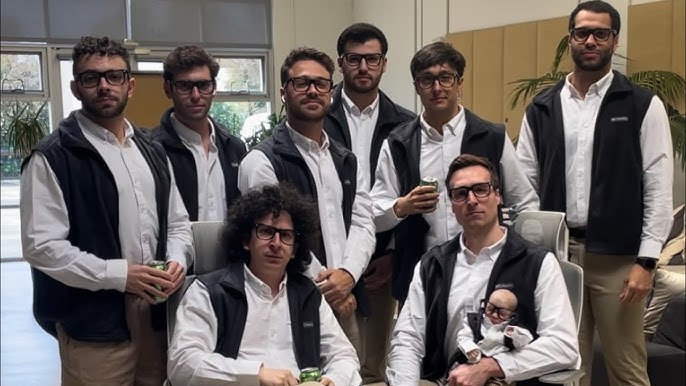

# Tech Industry and Their Fauna

Ah, Silicon Valley, the land of innovation, disruption, and overpriced oat milk lattes. They say it’s the pinnacle of human progress, where the smartest minds are working tirelessly to make the world a better place. Or at least, that’s what they *want* you to believe. In reality? It’s mostly about selling fancy apps, squeezing employees dry, and convincing rich investors to throw money at problems that never needed solving in the first place. 

And at the center of it all? The *tech bro*, a fascinating species that thrives on cold brew coffee, motivational tweets, and the undying belief that they’re the next Steve Jobs. 

## Meet the Tech Bro

You can spot a tech bro from a mile away. He’s the guy in a Patagonia vest, AirPods always in, sipping on a $14 green juice while speed-walking to his next "sync." His day starts at 5 AM with a freezing cold shower (because it "boosts cognitive function"), followed by some form of fasting that he claims is for "optimization," but is really just an excuse to skip breakfast and feel superior about it. 

He speaks in riddles, "Let’s leverage AI to disrupt the synergy of the blockchain!", which, when translated, usually means absolutely nothing. His LinkedIn posts read like a mix between a TED Talk and a self-help book written by a robot. 

And if you ever make the mistake of asking him what he does, buckle up. He’s about to tell you how he’s "revolutionizing the way humans interact with technology", which, after ten minutes, you’ll realize just means he’s working on an app that delivers smoothies slightly faster than before. 

## The Productivity Obsession (and the Inevitable Burnout)

Tech bros love the *hustle*. They worship at the altar of productivity, spending more time optimizing their workflow than actually doing work. Every hour of their day is meticulously planned, 5:00 AM ice bath, 5:30 AM meditation, 6:00 AM gratitude journaling, 6:15 AM listening to a podcast about "10X-ing" their mindset. And yet, somehow, they still miss deadlines. 

They preach work-life balance, but only in the sense that they schedule their "recharging time" like a dentist appointment. They proudly post about their *grindset* while chugging their fourth cold brew, bragging about how they haven’t taken a vacation in three years. If you remind them that sleep is important, they’ll hit you with a condescending "Sleep is for the weak, bro. I’m out here building the future."

Spoiler alert: the future is just another app no one asked for. 

## Fake Philanthropy and the "Changing the World" Illusion

Tech bros *love* pretending they’re saving the world. They donate a fraction of their millions to charity and immediately tweet about it. They launch billion-dollar foundations that mostly serve as tax havens. They talk endlessly about "giving back", meanwhile, their employees are one missed deadline away from being fired via Slack message.

And then there’s *effective altruism*, a concept that suggests the best way to help humanity is to get filthy rich first. It’s basically capitalism with a "good guy" filter slapped on top. They make billions underpaying workers, dodging taxes, and destroying traditional industries, and then they donate 0.0001% of their earnings and expect a Nobel Prize.

## The Office "Culture" (a.k.a. The Dystopia Disguised as Fun)

The tech world prides itself on its *amazing* work environments, unlimited PTO (that no one takes), nap pods (because you’ll be too exhausted to function otherwise), and a fridge full of kombucha (because why give you a raise when they can give you free drinks?).

"No hierarchy! We’re all one big family!" they say. Until layoffs happen, and suddenly half the "family" gets a "circle back" email that translates to "we don’t need you anymore."

And let’s not forget the bro culture. If you’re not a dude who wears Allbirds and plays ping pong at lunch, good luck fitting in. Women in tech still have to deal with endless nonsense, from being talked over in meetings to watching their ideas get stolen and repackaged by a guy named Chad.

## The Silicon Valley Savior Complex

Perhaps the worst part of tech bros is their *messiah complex*. They don’t just want to run companies, they want to be seen as visionaries, world-changers, gods of innovation. 

Elon Musk? Thinks we should all live on Mars (even though he can’t get his Teslas to stop catching on fire). Mark Zuckerberg? Swears the metaverse is the future (even though no one asked for it). Sam Altman? Warns about the dangers of AI while also profiting wildly from AI.

Their solutions to real-world problems are almost always ridiculous. Poverty? Give everyone crypto. Climate change? Invest in an app that tracks your carbon footprint (but doesn’t actually reduce emissions). Housing crisis? Buy up real estate and turn it into overpriced smart apartments. 

## Final Thoughts: Beware of the Bro

At the end of the day, tech bros are just really well-paid salesmen with fancy gadgets. They talk big about changing the world but mostly just create new ways to get you to subscribe to something. They say they care about employees, but burn them out faster than a malfunctioning Tesla battery. They claim to be innovators, but nine times out of ten, they’re just repackaging old ideas with new buzzwords. 

So next time a tech bro tries to sell you "the future," take a step back and ask: is this actually *better*? Or is it just another overpriced app trying to fix a problem that didn’t exist?

